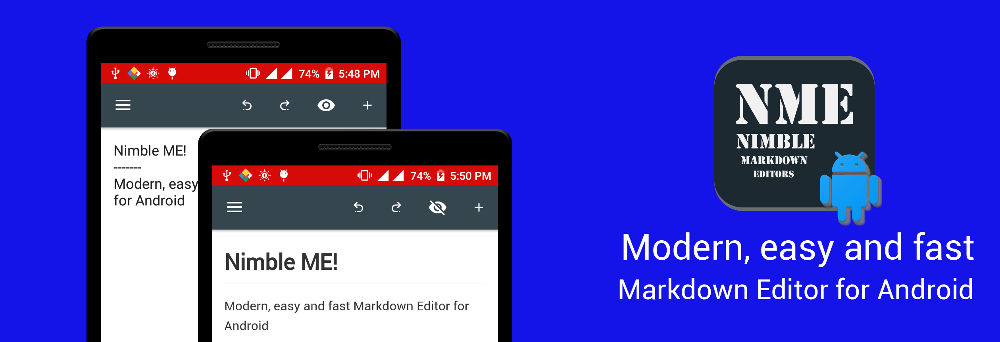

# NimbleME
Nimble Markdown Editor App for Android



This App is using 

```
dependencies {
    ...
    compile 'com.atlassian.commonmark:commonmark:0.6.0'
    compile 'com.atlassian.commonmark:commonmark-ext-gfm-tables:0.6.0'
    compile 'com.atlassian.commonmark:commonmark-ext-gfm-strikethrough:0.6.0'

    compile 'ren.qinc.edit:lib:0.0.3'
    
    //Used for Splash screen animation
    compile 'com.android.support.constraint:constraint-layout:1.0.0-beta3'
    
}

```
